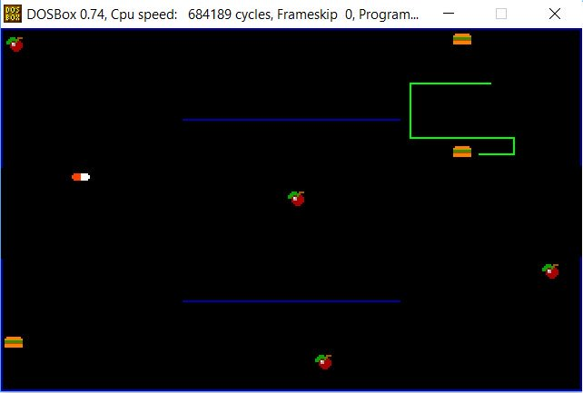

# yawc

**Archived legacy project. No active development.**

Yet Another Worm Clone. Implemented as 16-bit DOS assembly exercise.

## Requirements
- 16-bit DOS, runs on [DOSBox](https://www.dosbox.com/)
- NASM compiler (prebuild rekease on /bin folder)

## Usage
- Key mapping: 
  - Turn left: Left mouse button
  - Turn right: Right mouse button
